# Lab 01 — Two-Tier VPC with S3 Gateway Endpoint

## Part 1: Create the VPC

Created a VPC named `lab01-vpc` with CIDR block `10.0.0.0/16`.

This is the dedicated network everything in this lab lives in. Nothing here overlaps with anything else in my account.

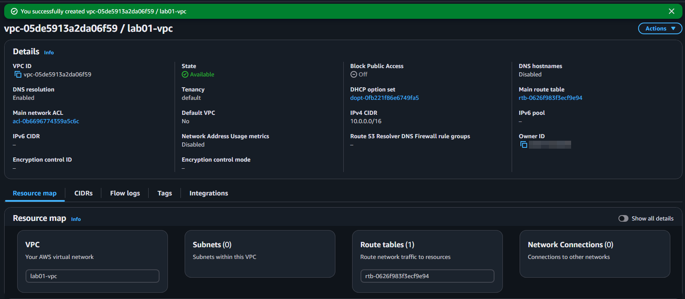

---

## Part 2: Create Subnets

Created two subnets inside the VPC:

| Subnet | CIDR Block | Purpose |
|--------|------------|---------|
| `lab01-public-subnet` | `10.0.1.0/24` | Bastion host |
| `lab01-private-subnet` | `10.0.2.0/24` | Private EC2 |

Neither subnet has internet access yet.

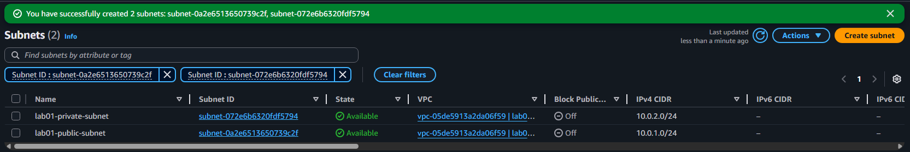

---

## Part 3: Attach an Internet Gateway

Created `lab01-igw` and attached it to the VPC.

A VPC has no internet access out of the box. You need an internet gateway attached plus a route pointing to it before any traffic can leave.

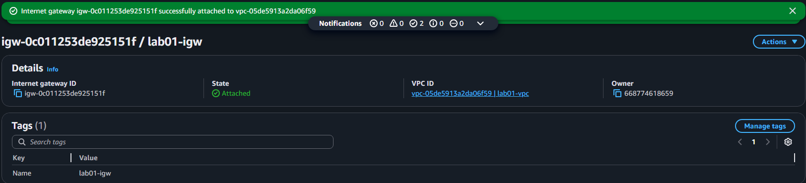

---

## Part 4: Configure Route Tables

Created a public route table named `lab01-public-rt` and added a route:

| Destination | Target |
|-------------|--------|
| `0.0.0.0/0` | `lab01-igw` |

Associated it with the public subnet.

The private subnet has no internet route on purpose. It can only communicate with other resources inside the VPC.

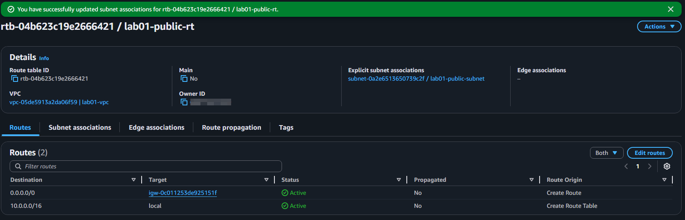

---

## Part 5: Create Security Groups

### Bastion Security Group — `lab01-bastion-sg`

SSH on port 22 allowed from my IP only.

Allowing `0.0.0.0/0` would open it to the entire internet. Scoping it to my IP means only my machine can connect.

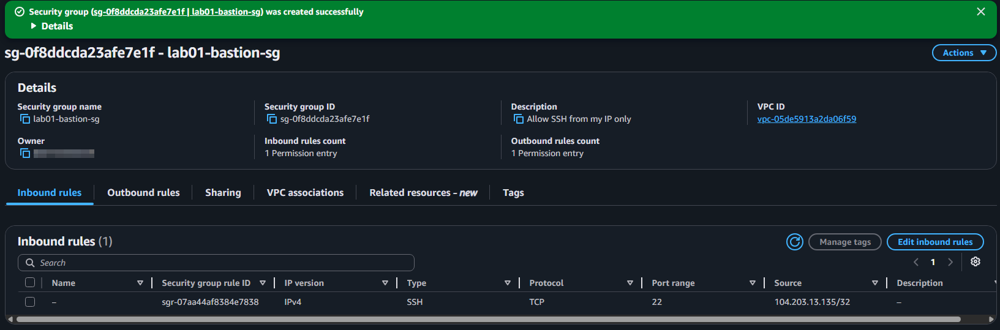

### Private EC2 Security Group — `lab01-private-sg`

SSH allowed only from `lab01-bastion-sg`.

This references the bastion's security group directly instead of an IP range. Only traffic coming from the bastion can reach this instance. Nothing from the internet can get to it directly.

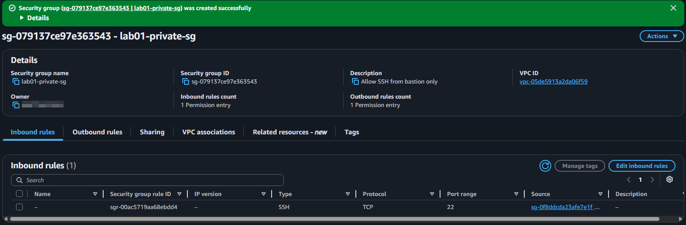

---

## Part 6: Launch Bastion Host

Launched `lab01-bastion`:

* Amazon Linux 2023
* `t3.micro`
* Public subnet
* Public IP enabled
* `lab01-bastion-sg` attached

The bastion is the only way into the private subnet. You connect to it first, then jump from there to the private EC2.

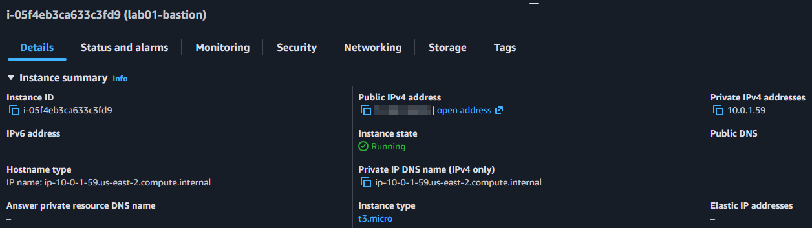

---

## Part 7: Launch Private EC2

Launched `lab01-private`:

* Amazon Linux 2023
* `t3.micro`
* Private subnet
* No public IP
* `lab01-private-sg` attached

No public IP and no internet route. You cannot reach this instance from outside the VPC.

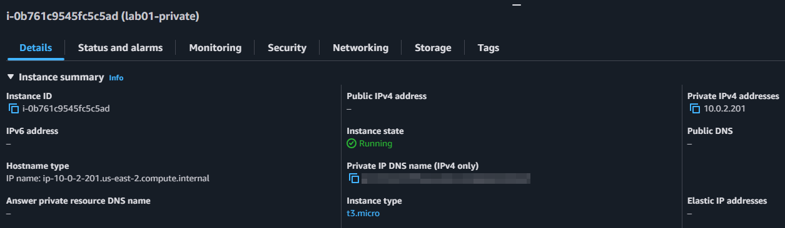

---

## Part 8: Configure Network ACL

Created `lab01-private-nacl` and associated it with the private subnet.

Security groups are stateful. They track connections and automatically allow return traffic. NACLs are not. You have to write rules for both directions or connections will break.

### Inbound Rules

| Rule | Type | Port | Source | Action |
|------|------|------|--------|--------|
| 100 | SSH | 22 | `10.0.1.0/24` | Allow |
| 110 | Custom TCP | 1024-65535 | `0.0.0.0/0` | Allow |
| 200 | All traffic | All | `0.0.0.0/0` | Deny |

### Outbound Rules

| Rule | Type | Port | Destination | Action |
|------|------|------|-------------|--------|
| 90 | HTTPS | 443 | `0.0.0.0/0` | Allow |
| 100 | Custom TCP | 1024-65535 | `0.0.0.0/0` | Allow |
| 200 | All traffic | All | `0.0.0.0/0` | Deny |

The ephemeral ports (1024-65535) are for return traffic. When a server responds to your request, it sends the response back on a random high port. If you do not allow that range inbound, the response gets dropped and the connection hangs.

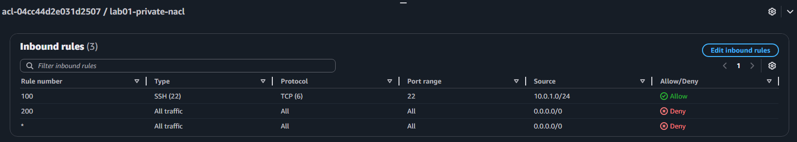

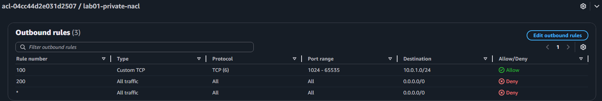

---

## Part 9: Create S3 Gateway Endpoint

Created a VPC Gateway Endpoint named `lab01-s3-endpoint` for `com.amazonaws.us-east-2.s3` and associated it with the private route table.

AWS added a route for S3 traffic automatically. The private EC2 can now reach S3 without touching an internet gateway or NAT gateway. The traffic goes through AWS's internal network instead.

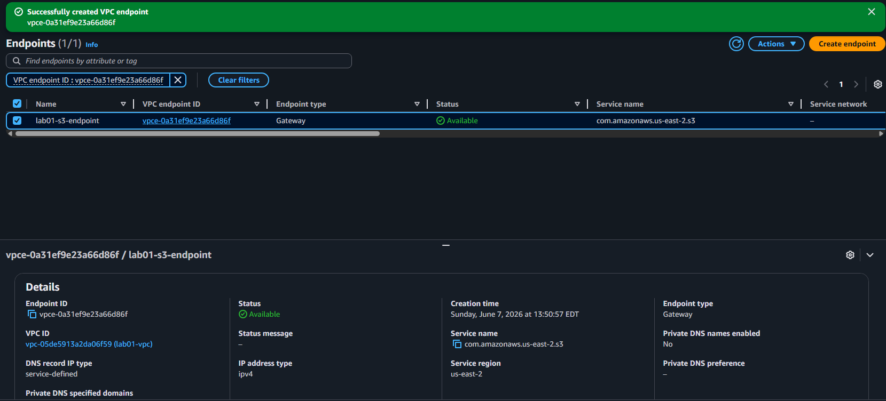

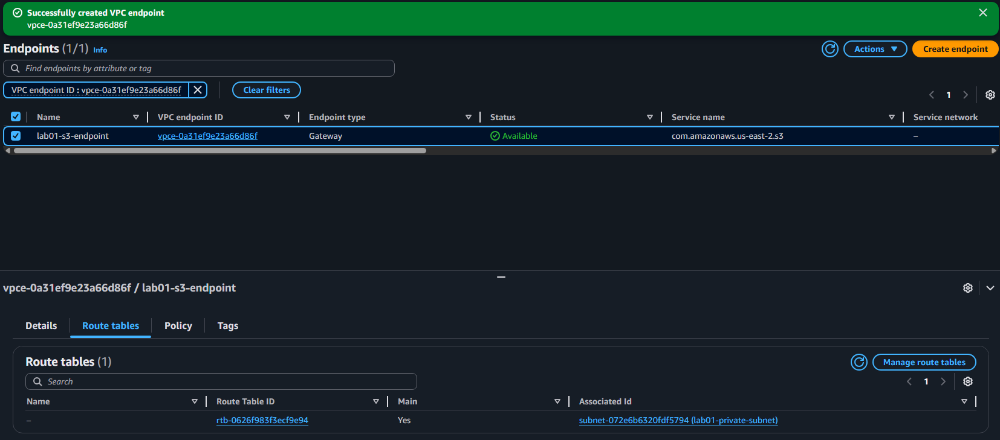

---

## Part 10: Attach IAM Role to Private EC2

Created `lab01-ec2-s3-role` with `AmazonS3ReadOnlyAccess` and attached it to `lab01-private`.

EC2 instances have no AWS permissions by default. An IAM role is the right way to grant access. No credentials on the server, nothing to rotate, nothing to accidentally expose.

---

## Part 11: Testing

Connected to the bastion first, then jumped to the private EC2:
eval $(ssh-agent -s)

ssh-add /path/to/lab01-keypair.pem

ssh -A ec2-user@<BASTION-PUBLIC-IP>
From the bastion:
ssh ec2-user@10.0.2.x

The `-A` flag is SSH agent forwarding. It lets the bastion use your local key to connect to the private EC2. You never copy the key file to the bastion.

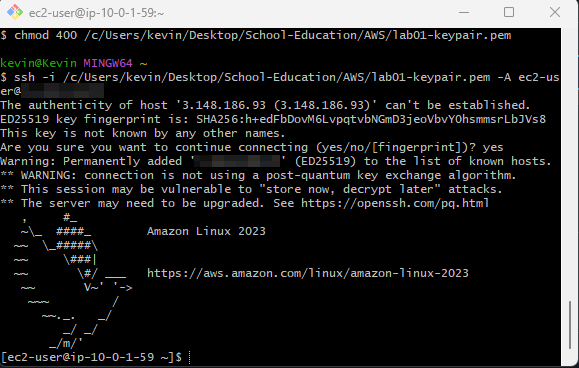

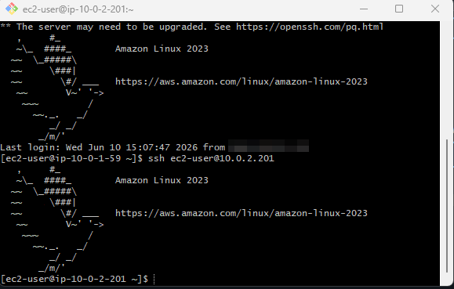

From inside the private EC2:
aws s3 ls --region us-east-2

curl https://google.com --max-time 5

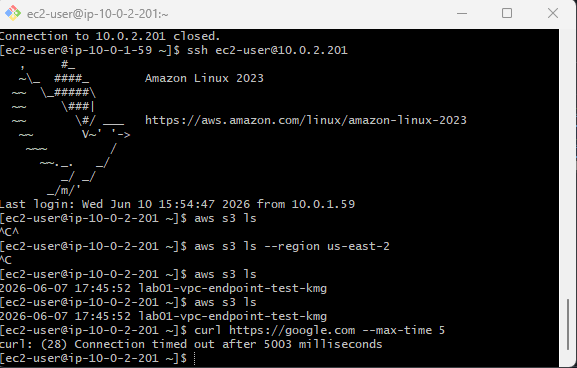

`aws s3 ls` returned my bucket. S3 works through the gateway endpoint with no internet access.

`curl` timed out after 5 seconds. The instance has no internet route and cannot reach anything outside AWS.

---

## Part 12: Cleanup

Deleted resources in order to avoid dependency errors:

1. Terminated both EC2 instances
2. Deleted the S3 bucket
3. Deleted the VPC Gateway Endpoint
4. Disassociated and deleted the custom NACL
5. Detached the IAM role
6. Deleted the IAM role
7. Deleted custom Security Groups
8. Detached and deleted the Internet Gateway
9. Deleted both subnets
10. Deleted the custom route table
11. Deleted the VPC

---

# Troubleshooting Log

## Issue 1: SSH Permission Denied

### What happened

Permission denied (publickey)

### Why

The SSH agent was not running and the key was not loaded.

### Fix
eval $(ssh-agent -s)

ssh-add /path/to/lab01-keypair.pem

ssh -A ec2-user@<BASTION-IP>

### What I learned

The `-A` flag forwards your key to the bastion. But if you never ran `ssh-add`, there is no key to forward. You have to load it into the agent first.

---

## Issue 2: `aws s3 ls` Hanging

### What happened

The command hung with no output and no error.

The IAM role was attached. The S3 endpoint route was in the route table. Everything looked right.

### What I checked

* IAM role attached: yes
* S3 endpoint route in the route table: yes
* No public IP on the private EC2: yes
* Security group rules: fine
* NACL rules: missing

### Why

The NACL was dropping return traffic. The outbound request on port 443 was leaving the subnet. But when the response came back on an ephemeral port, there was no inbound rule to allow it. The response got dropped silently.

### Fix

* Outbound Rule 90: Allow HTTPS port 443
* Inbound Rule 110: Allow TCP 1024-65535

The command worked immediately after.

### What I learned

Security groups handle return traffic automatically. NACLs do not. If a NACL is missing a return traffic rule, the connection hangs without giving you a clear error. This is one of the most common AWS networking mistakes and a regular SAA-C03 exam topic.

---

# Key Concepts Demonstrated

* Public and private subnet design
* Internet Gateway and route table configuration
* Bastion host access pattern
* Security group source restrictions and references
* NACL stateless behavior and ephemeral ports
* S3 Gateway Endpoint for private S3 access
* IAM role for EC2
* Troubleshooting network and identity layers
* Secure cleanup
