# Lab 02 — S3 Encryption with KMS

## Part 1: Create the IAM Role

Created a role named `lab02-s3-kms-role` with `AmazonS3ReadOnlyAccess` attached.

This role gets added to the KMS key policy in the next step. It will be the only identity allowed to encrypt and decrypt objects in the bucket. Using a role means no static credentials stored anywhere.

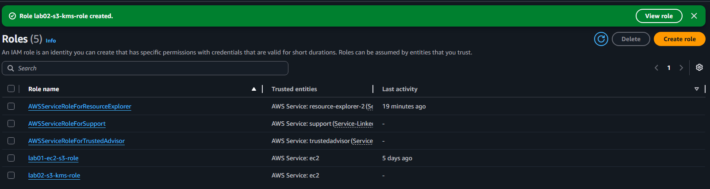

---

## Part 2: Create the Restricted IAM User

Created a user named `lab02-restricted-user` with `AmazonS3ReadOnlyAccess` attached.

This user can read S3 objects but will not be added to the KMS key policy. The goal is to prove that S3 read access alone is not enough when a custom KMS key is involved.

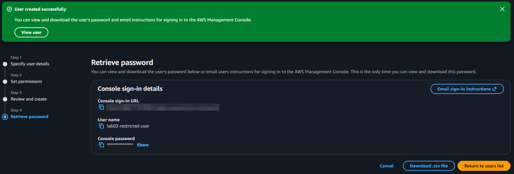

---

## Part 3: Create a Custom KMS Key

Created a symmetric KMS key with the alias `lab02-s3-key`.

I added `lab02-s3-kms-role` to the key usage permissions. The restricted user was left out on purpose.

The key policy controls who can encrypt and decrypt. It is separate from S3 bucket policies and IAM policies. If you are not in the key policy, KMS blocks you. It does not matter what S3 allows.

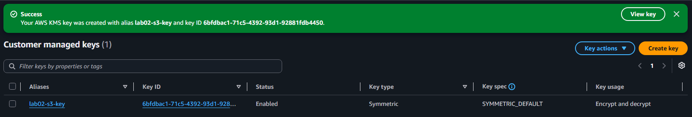

---

## Part 4: Create the S3 Bucket with SSE-KMS Default Encryption

Created a bucket named `lab02-kms-encryption-test-kmg` in `us-east-2` with default encryption set to SSE-KMS using `lab02-s3-key`.

Every object uploaded to this bucket gets encrypted with the custom key automatically. There is no way to upload something unencrypted.

| Setting | Value |
|---------|-------|
| Bucket name | `lab02-kms-encryption-test-kmg` |
| Region | `us-east-2` |
| Default encryption | SSE-KMS |
| KMS key | `lab02-s3-key` |
| Block public access | Enabled |

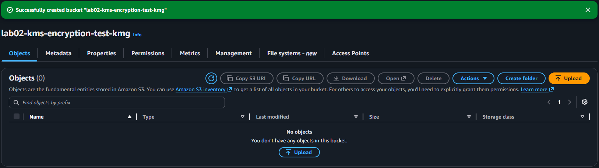

---

## Part 5: Upload a Test File and Confirm Encryption

Created `secret-file.txt` and uploaded it to the bucket.

After the upload I checked the object properties to confirm the KMS key ARN was listed under encryption. It was there, confirming SSE-KMS applied automatically.

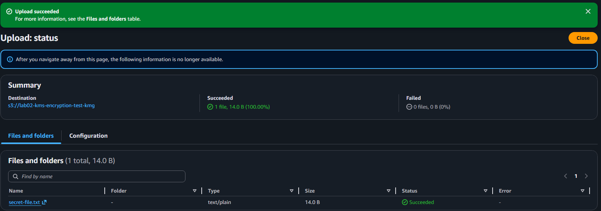

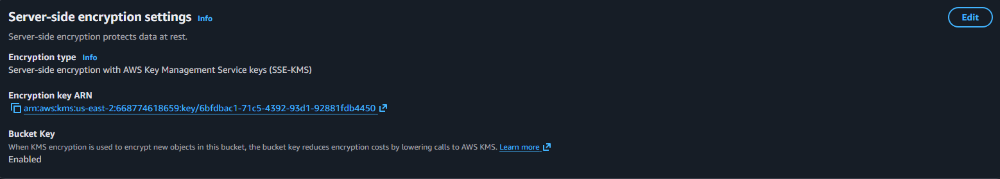

---

## Part 6: Confirm Access Denied for Restricted User

Signed in as `lab02-restricted-user` in a separate browser window and went to the bucket.

The file showed up in the list. `AmazonS3ReadOnlyAccess` gives `s3:GetObject`, so S3 is not blocking anything. But when I tried to download it, the request failed.

Here is what actually happens: before S3 can serve an encrypted object, it has to call KMS to decrypt it. KMS checks the key policy, sees that `lab02-restricted-user` is not listed, and denies the request. S3 never gets the data back.

The error confirmed it:

`lab02-restricted-user is not authorized to perform: kms:Decrypt on resource: arn:aws:kms:us-east-2:...:key/...`

S3 access and KMS access are two separate things. Having one does not give you the other.

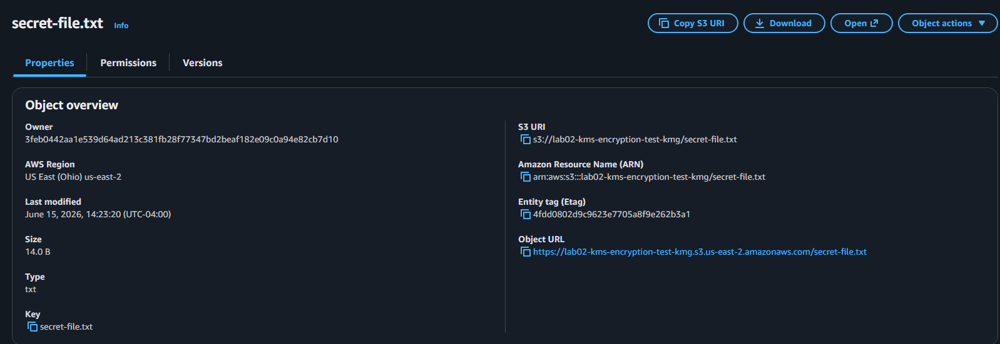

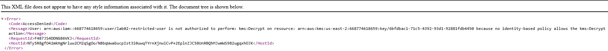

---

## Part 7: Enable S3 Versioning

Enabled versioning from the bucket Properties tab.

With versioning on, S3 keeps every version of an object each time it is uploaded. I edited `secret-file.txt` and uploaded it again. Both versions showed up under the Versions tab with separate version IDs.

This protects against accidental deletes and overwrites. Each version is encrypted with the KMS key independently.

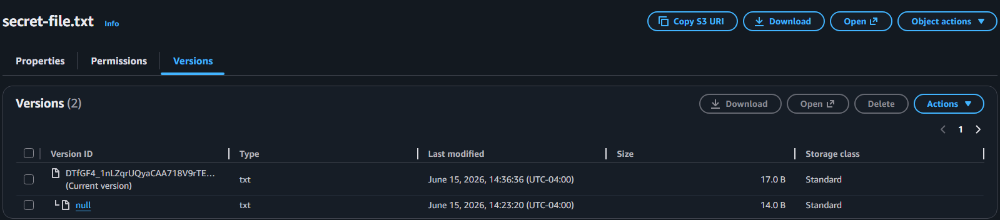

---

## Part 8: Create a Lifecycle Rule for Glacier

Created a lifecycle rule named `lab02-glacier-transition` to move all objects to S3 Glacier Flexible Retrieval after 30 days.

| Setting | Value |
|---------|-------|
| Rule name | `lab02-glacier-transition` |
| Scope | All objects in the bucket |
| Transition | S3 Glacier Flexible Retrieval |
| Days after creation | 30 |

Glacier costs around $0.004/GB/month. S3 Standard is $0.023/GB/month. For data you have to keep but rarely access, the lifecycle rule handles the move automatically.

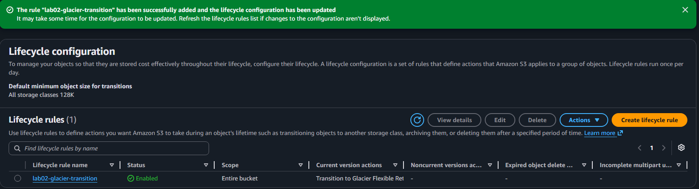

---

## Part 9: Cleanup

Deleted everything in order to avoid charges.

1. Emptied and deleted the S3 bucket (clears all object versions)
2. Scheduled KMS key deletion with a 7-day waiting period
3. Deleted `lab02-restricted-user`
4. Deleted `lab02-s3-kms-role`

AWS requires a minimum 7-day wait before a KMS key is permanently deleted. You stop being charged once deletion is scheduled.

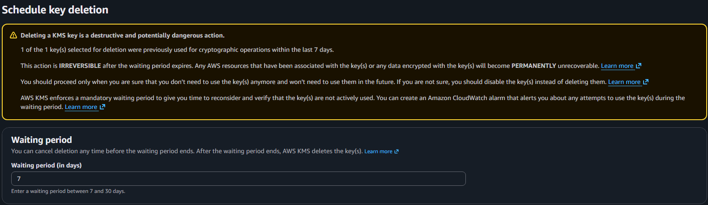

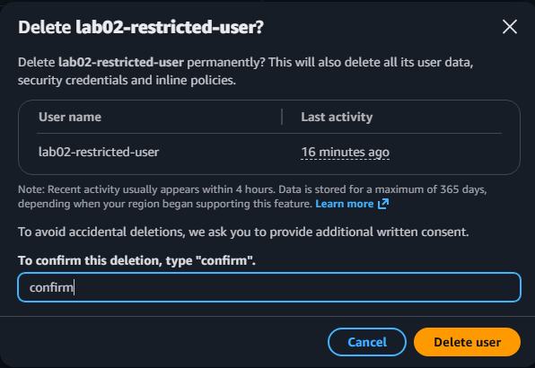

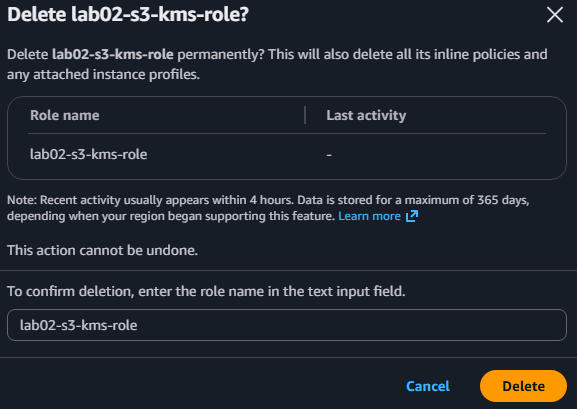

---

# Key Concepts Demonstrated

* SSE-KMS default encryption at the bucket level
* Customer-managed KMS keys vs AWS-managed keys
* KMS key policies as a separate access control layer
* Why S3 read access is not enough when objects are KMS-encrypted
* S3 versioning for protection against overwrites and accidental deletes
* Lifecycle rules for automatic Glacier archiving
* Least privilege: KMS key scoped to one role only
* Cleanup including KMS key deletion scheduling
